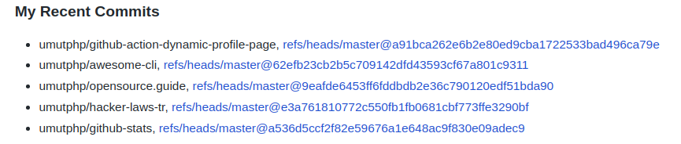

# Dynamic Profile Page On GitHub

A GitHub action to push updates to your special profile repo.

### Why?

GitHub announced a special repository (github_username/github_username) so that its README.md file will appear on your profile page. People liked it a lot and started using some static pages with fancy texts and images. This GitHub action helps you to add a section that is updated dynamically when you commit a repository that uses this action. A line per repository is added to the section and the lines are ordered from the newest to the oldest. You can see a sample execution in [my profile page](https://github.com/umutphp).



Please feel free to fork it or contribute to it.

## Usage

Follow the steps;
- Create your special repository if not exists.
- Add `<!-- START gadpp -->` add the end of the README.md file of the special repo.
- Create a personal access token [here](https://github.com/settings/tokens) and set the `repo` permission.
- Add the access token created in previous step to the repository (that uses this action) as a secret with name `API_TOKEN_GITHUB`.
- Create the YML file for the action under `.github/workflows`. You can use the sample given below. Please update `YOUR_GITHUB_USERNAME` and `EMAIL_USED_ON_GITHUB` values.
- Please do not forget to add checkout step before GADPP step in your pipeline.

## Example YML File To Create A Workflow With This Action

```yml
name: Update GitHub Profile Page
on: [push]

jobs:
  gadpp_job:
    runs-on: ubuntu-latest
    name: Update GitHub Profile Page
    steps:
      - name: Checkout
        uses: actions/checkout@v2
      - name: GADPP
        uses: umutphp/github-action-dynamic-profile-page@v2
        id: gadpp
        env:
          API_TOKEN_GITHUB: ${{ secrets.API_TOKEN_GITHUB }}
          GITHUB_TOKEN: ${{ secrets.GITHUB_TOKEN }}
        with:
          github-username: 'YOUR_GITHUB_USERNAME'
          user-email: 'EMAIL_USED_ON_GITHUB'

```
